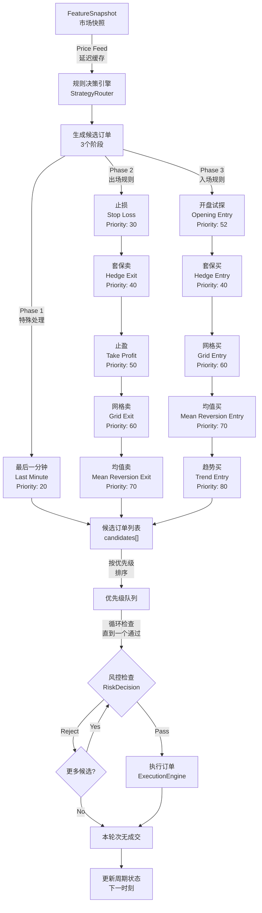
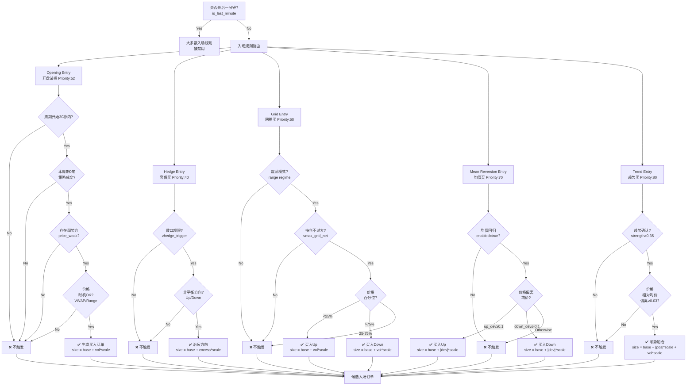
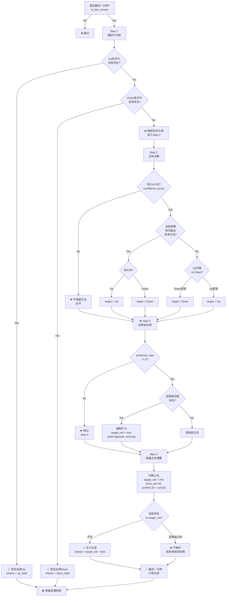

# 策略流程图与代码对比注记

本文档为方案二，通过流程图和代码对比注记快速定位代码与原文档的差异。

---

## 流程图 1：整体规则路由与优先级



**关键特性**：
- 三个决策阶段独立运行，然后合并
- 优先级排序发生在风控之前
- **优先级最高的通过即执行，其他同时触发的规则本轮被跳过**

---

## 流程图 2：入场规则决策树



**优先级说明**：
- Opening (52) > Hedge/Grid/Mean Reversion/Trend
- Hedge/Grid (40/60) > Mean Reversion (70) > Trend (80)
- 最高优先级先执行，低优先级等待下一时刻

---

## 流程图 3：出场规则决策树

```mermaid
graph TD
    A["出场规则路由"] --> B["Stop Loss<br/>止损 Priority:30"]
    B --> B1{"周期亏损<br/>≥20?"}
    B1 -->|No| B2["❌ 不触发"]
    B1 -->|Yes| B3{"Up有浮亏<br/>且有持仓?"}
    B3 -->|Yes| B4["✅ 卖出Up<br/>shares = held*0.5"]
    B3 -->|No| B5{"Down有浮亏<br/>且有持仓?"}
    B5 -->|Yes| B6["✅ 卖出Down<br/>shares = held*0.5"]
    B5 -->|No| B2
    B4 --> C
    B6 --> C
    B2 --> C
    
    C["Hedge Exit<br/>套保卖 Priority:40"]
    C --> C1{"非尾盘?<br/>not last_minute"}
    C1 -->|No| C2["❌ 尾盘禁用"]
    C1 -->|Yes| C3{"敞口超限<br/>≥50且周期<br/>有浮盈?"}
    C3 -->|No| C4["❌ 不触发"]
    C3 -->|Yes| C5{"Up有浮盈<br/>且有持仓?"}
    C5 -->|Yes| C6["✅ 卖出Up<br/>shares = min(held, exposure*0.1)"]
    C5 -->|No| C7{"Down有浮盈<br/>且有持仓?"}
    C7 -->|Yes| C8["✅ 卖出Down<br/>shares = min(held, exposure*0.1)"]
    C7 -->|No| C4
    
    C6 --> D
    C8 --> D
    C4 --> D
    C2 --> D
    
    D["Take Profit<br/>止盈 Priority:50"]
    D --> D1{"Up浮盈且<br/>up_dev≥0.2?"}
    D1 -->|Yes| D2["✅ 卖出Up<br/>shares = held*0.35"]
    D1 -->|No| D3{"Down浮盈且<br/>down_dev≥0.2?"}
    D3 -->|Yes| D4["✅ 卖出Down<br/>shares = held*0.35"]
    D3 -->|No| D5["❌ 不触发"]
    D2 --> E
    D4 --> E
    D5 --> E
    
    E["Grid Exit<br/>网格卖 Priority:60"]
    E --> E1{"非尾盘<br/>且range模式?"}
    E1 -->|No| E2["❌ 不触发"]
    E1 -->|Yes| E3{"价格高位<br/>≥75%<br/>且持有Up?"}
    E3 -->|Yes| E4["✅ 卖出Up<br/>shares = held*0.25"]
    E3 -->|No| E5{"价格低位<br/>≤25%<br/>且持有Down?"}
    E5 -->|Yes| E6["✅ 卖出Down<br/>shares = held*0.25"]
    E5 -->|No| E2
    
    E4 --> F
    E6 --> F
    E2 --> F
    
    F["Mean Reversion Exit<br/>均值卖 Priority:70"]
    F --> F1{"非尾盘<br/>且均值启用?"}
    F1 -->|No| F2["❌ 不触发"]
    F1 -->|Yes| F3{"持有Up<br/>且up_dev≥0.2?"}
    F3 -->|Yes| F4["✅ 卖出Up<br/>shares = held*0.4"]
    F3 -->|No| F5{"持有Down<br/>且down_dev≥0.2?"}
    F5 -->|Yes| F6["✅ 卖出Down<br/>shares = held*0.4"]
    F5 -->|No| F2
    
    F4 --> G["候选出场订单"]
    F6 --> G
    F2 --> G
```



**执行顺序**：
1. 止损（最高）→ 2. 套保卖 → 3. 止盈 → 4. 网格卖 → 5. 均值卖

---

## 流程图 4：最后一分钟四步流程



**Step 关键点**：
- **Step 1** 必须执行完，若平掉亏损则结束
- **Step 2-4** 仅在两侧均无亏损时执行
- **Step 3** 新机制，用于维持优势侧最小比例
- **Step 4** 买入补足，不主动卖出

---

## 对比注记：原文档 vs 代码实现

### 注记 1：规则优先级的实现

**原文档位置**：《规则优先级》章节

**原文档说法**：
> 同一时刻如果多个规则同时触发，只执行优先级最高的一个订单意图。

**代码实现**：
```python
# router.py: 按优先级排序所有候选订单
candidates.sort(key=lambda x: -x.priority)

for candidate in candidates:
    decision = apply_risk_limits(features, candidate, config)
    if decision.accepted:
        # 执行此订单
        break  # 其他同时触发的规则本轮被跳过
```

**注记**：✅ 原理一致，实现完全符合。

---

### 注记 2：Opening Entry（新增规则）

**原文档**：完全未提及

**代码实现**：完整的 `opening_entries()` 函数，包含：
- 周期开始30秒窗口
- 弱势方推断逻辑（基于双边价格）
- VWAP 和区间相对位置检查
- 下单量 = base + volatility_ratio * scale

**需要补充**：
```markdown
### Opening Entry（周期开盘试探建仓）[代码新增]

- 触发条件：
  - 周期开始 <= 30秒
  - 本周期无策略成交（strategy_trades == 0）
  - 存在相对弱势价格一侧
  - 价格不高于该侧 VWAP 或处于区间低位
- 下单量 = base_order_size + volatility_ratio * volatility_order_scale
- 优先级：52
```

---

### 注记 3：Trend Entry 的向下偏离检查

**原文档位置**：《买入规则 → Trend》

**原文档说法**：
> 当前价格相对对应方向均价的偏离 `>= trend_price_edge`

**代码实现**：
```python
deviation = features.up_deviation if features.trend_bias == "up" else features.down_deviation
if deviation < price_edge:
    return []
```

**注记**：✅ 完全一致。

---

### 注记 4：Hedge Entry 的敞口计算

**原文档位置**：《买入规则 → Hedge》

**原文档说法**：
> 下单量 = `base_order_size + exposure_excess * hedge_scale`
> 
> 其中外敞口超过 trigger 的部分为 exposure_excess

**代码实现**：
```python
excess = max(0.0, exposure - trigger)
size = _base_size(config, features) + excess * float(config.get("exposure.hedge_scale", 0.15))
```

**注记**：✅ 完全一致。

---

### 注记 5：Hedge Exit 的单边限制 ⚠️

**原文档位置**：《卖出规则 → Hedge Sell》

**原文档说法**：
> 卖出盈利方向部分仓位，缩小单边暴露

**代码实现**：
```python
if features.unrealized_up_pnl > 0 and _held_up(features) > 0:
    return [OrderIntent(..., outcome="up", ...)]
# 下面的分支永不执行
if features.unrealized_down_pnl > 0 and _held_down(features) > 0:
    return [OrderIntent(..., outcome="down", ...)]
```

**注记**：⚠️ **代码缺陷**：只能卖出一侧，无法同时对冲两侧风险。
- 当 Up 和 Down 都有浮盈时，只会卖出 Up
- 建议改为可返回多个意图，或按对称逻辑卖出双侧

---

### 注记 6：Grid Exit 的卖出比例硬编码

**原文档位置**：《卖出规则 → Grid Sell》

**原文档说法**：
> 完成网格低买高卖循环

**代码实现**：
```python
shares=max(0.0, _held_up(features) * 0.25)  # 硬编码 25%
shares=max(0.0, _held_down(features) * 0.25)
```

**注记**：⚠️ **文档缺失**：卖出比例（25%）未在原文档中说明。
- 建议文档补充：`Grid Sell 默认卖出 25% 的持仓`
- 或添加配置参数：`grid.grid_exit_fraction: 0.25`

---

### 注记 7：Mean Reversion Entry 的线性放大

**原文档位置**：《买入规则 → Mean Reversion》

**原文档说法**：
> 下单量按偏离比例线性放大，最大不超过 `max_order_size`

**代码实现**：
```python
shares=_base_size(config, features) + features.up_deviation * deviation_scale
# 其中 deviation_scale 默认 45.0，无上限约束
```

**注记**：⚠️ **文档与代码不符**：
- 原文档提及 `max_order_size` 上限
- 代码中未见此上限，由单独的风控检查处理
- 建议澄清：max_order_size 是全局约束还是规则级约束

---

### 注记 8：Mean Reversion Exit 的卖出比例硬编码

**原文档位置**：《卖出规则 → Mean Reversion Sell》

**原文档说法**：
> 按偏离程度卖出对应方向仓位

**代码实现**：
```python
shares=max(0.0, _held_up(features) * 0.4)  # 硬编码 40%
shares=max(0.0, _held_down(features) * 0.4)
```

**注记**：⚠️ **文档缺失**：卖出比例（40%）未在原文档中说明。
- 建议文档补充：`Mean Reversion 卖出 40% 的持仓`
- 硬编码与"按偏离程度"的描述不符，应添加配置项

---

### 注记 9：最后一分钟的置信度公式

**原文档位置**：《特征定义 → 信心代理》

**原文档说法**：（未提及具体公式）

**代码实现**：
```python
def _confidence_proxy(net_profit: float, price_move: float, volatility: float) -> float:
    signal = abs(net_profit) + abs(price_move)
    if volatility <= 1e-10:
        return 0.5
    return max(0.0, min(1.0, signal / (signal + volatility)))
```

**注记**：✅ 代码实现了原始设想。文档应补充此公式的解释。

---

### 注记 10：Stop Loss 只卖一侧 ⚠️

**原文档位置**：《卖出规则 → Stop Loss》

**原文档说法**：
> 优先卖出当前净方向持仓
> 若净方向平衡，则卖出浮亏方向持仓

**代码实现**：
```python
if features.unrealized_up_pnl < 0 and _held_up(features) > 0:
    return [OrderIntent(...)]
if features.unrealized_down_pnl < 0 and _held_down(features) > 0:
    return [OrderIntent(...)]
```

**注记**：⚠️ **行为差异**：代码只卖出"第一个"浮亏方向，与原文档的逻辑不完全对应。
- 原文档：先考虑净方向，再考虑浮亏方向
- 代码：第一个有浮亏的方向直接返回
- 建议补充说明或优化逻辑

---

### 注记 11：Price Feed 缓存机制（新增）

**原文档**：完全未提及

**代码实现**：`router.py` 中的 `_snapshot_for_rule()` 和 `_feed_interval_seconds()`

**作用**：
- 为不同规则提供可选的延迟价格更新
- 避免高频振荡导致规则频繁切换

**需要补充**：
```markdown
### Price Feed 缓存机制（代码新增）

每条规则可独立配置价格缓存间隔，在该间隔内使用上次缓存的价格而不更新。

配置示例：
rule_price_feed:
  last_minute: 0.0      # 实时
  entries.trend: 5.0    # 延迟5秒
  exits.hedge: 2.0      # 延迟2秒
```

---

### 注记 12：Last Minute 的双边比例约束（新增机制）

**原文档**：未提及

**代码实现**：`last_minute.py` 中的 `preferred_leg_min_ratio` 逻辑

```python
ratio = float(config.get("last_minute.preferred_leg_min_ratio", 1.0))
if ratio > 1.0 + 1e-12:
    favored = _favored_outcome_by_unrealized(features)
    # 强制优势侧持仓 >= ratio * 对方持仓
```

**作用**：维持尾盘仓位的最小双边比例，避免过度单边持仓。

**需要补充**：
```markdown
### Last Minute 双边比例约束

当 preferred_leg_min_ratio > 1.0 时，强制优势侧仓位 >= ratio * 弱侧仓位。

示例：ratio=1.5 时，若 Down 持仓10、Up持仓5，则强制保留 Down 并调整至 15。
```

---

### 注记 13：Market Limits 和现金约束（新增）

**原文档**：仅提及 `use_orderbook_min_order_size`

**代码新增约束**：
- `min_seconds_between_orders` - 相邻成交最小间隔
- `min_same_outcome_price_move_ratio` - 同方向最小价格波动
- `max_cash_utilization` 和 `min_cash_buffer` - 现金利用率

**需要补充**：
```markdown
### 新增风控约束（代码仅实现）

1. 相邻成交时间约束：同方向相邻成交间隔 >= min_seconds_between_orders（默认2秒）
2. 价格波动约束：同方向上次填充价格相对波动 >= min_same_outcome_price_move_ratio（默认3%）
3. 现金约束：购买力 = account_cash * max_cash_utilization - min_cash_buffer
```

---

### 注记 14：Risk 拦截的实际优先级

**原文档位置**：《规则优先级》

**原文档表述**：
> 1. `risk`（隐含）

**代码实现**：风控检查在优先级排序**之后**，对每个候选订单逐个检查

**注记**：⚠️ **优先级理解差异**：
- Risk 不是一个"规则"，而是全局检查机制
- 不受优先级排序影响，对所有订单等同对待
- 只要通过风控检查，就能执行（不会因为高优先级的失败而被拦截）

**建议澄清文档**：Risk 应描述为"全局过滤器"而非"规则"。

---

## 总结表

| # | 项目 | 文档 | 代码 | 一致性 | 备注 |
|----|------|------|------|--------|------|
| 1 | Opening Entry | ❌ 无 | ✅ 完整 | ⚠️ 差异 | 代码新增规则 |
| 2 | Price Feed 缓存 | ❌ 无 | ✅ 完整 | ⚠️ 差异 | 代码新增机制 |
| 3 | Trend Entry 偏离检查 | ✅ 完整 | ✅ 完整 | ✅ 一致 | |
| 4 | Hedge Entry 敞口计算 | ✅ 完整 | ✅ 完整 | ✅ 一致 | |
| 5 | Hedge Exit 单边限制 | ❓ 模糊 | ⚠️ 缺陷 | ⚠️ 差异 | **代码只卖一侧** |
| 6 | Grid Exit 卖出比例 | ❌ 无 | ✅ 25% | ⚠️ 差异 | **硬编码未文档化** |
| 7 | Mean Rev Entry 线性放大 | ✅ 提及 | ✅ 完整 | ✅ 一致 | 但无上限约束说明 |
| 8 | Mean Rev Exit 卖出比例 | ❌ 无 | ✅ 40% | ⚠️ 差异 | **硬编码未文档化** |
| 9 | Confidence Proxy 公式 | ❌ 无 | ✅ 完整 | ⚠️ 差异 | 代码有具体实现 |
| 10 | Stop Loss 逻辑 | ✅ 描述 | ⚠️ 简化 | ⚠️ 差异 | **代码只卖一侧** |
| 11 | Last Minute 双边比例 | ❌ 无 | ✅ 完整 | ⚠️ 差异 | 代码新增机制 |
| 12 | 市场最小下单量 | ✅ 部分 | ✅ 完整 | ✅ 一致 | |
| 13 | 相邻成交约束 | ❌ 无 | ✅ 完整 | ⚠️ 差异 | 代码新增约束 |
| 14 | 价格波动约束 | ❌ 无 | ✅ 完整 | ⚠️ 差异 | 代码新增约束 |
| 15 | 现金利用率约束 | ❌ 无 | ✅ 完整 | ⚠️ 差异 | 代码新增约束 |

---

## 建议的文档更新清单

### 优先级 P0（必须补充）
- [ ] 补充 Opening Entry 规则完整描述
- [ ] 补充 Grid Exit / Mean Reversion Exit 的硬编码卖出比例说明
- [ ] 补充 Last Minute 的双边比例约束机制
- [ ] 修复 Hedge Exit 和 Stop Loss 的单边卖出说明

### 优先级 P1（应该补充）
- [ ] 新增 Price Feed 缓存机制章节
- [ ] 补充 Confidence Proxy 的精确计算公式
- [ ] 明确说明相邻成交、价格波动、现金约束等新增风控

### 优先级 P2（可选补充）
- [ ] 详细解释 Opening Entry 的弱势方推断逻辑
- [ ] 补充各规则的配置参数默认值表格
- [ ] 增添流程图以提高可读性

