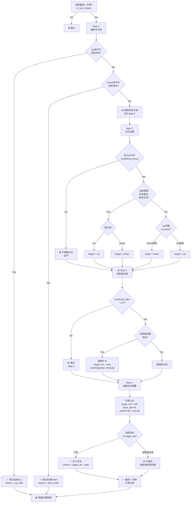

# 策略流程图与代码对比注记

本文档为完整版更新，基于 20+ 次代码迭代，包含流程图、代码实现对比、已知缺陷和改进建议。

**最后更新**：2026年03月25日

---

## 流程图 1：整体规则路由与优先级


**关键特性**：
- 三个决策阶段独立运行，然后合并
- 优先级排序发生在风控之前，同优先级按份额降序
- **优先级最高的通过即执行，其他同时触发的规则本轮被跳过**
- 排序逻辑：`candidates.sort(key=lambda item: (item.priority, -item.shares))`

---

## 流程图 2：入场规则决策树

```mermaid
graph TD
    A["是否最后一分钟?<br/>is_last_minute"] -->|Yes| B["大多数入场规则<br/>被禁用"]
    A -->|No| C["入场规则路由"]
    
    C --> D["Opening Entry<br/>开盘试探 Priority:52"]
    D --> D1{"周期开始30秒内?"}
    D1 -->|No| D2["❌ 不触发"]
    D1 -->|Yes| D3{"本周期0笔<br/>策略成交?"}
    D3 -->|No| D2
    D3 -->|Yes| D4{"存在弱势方<br/>price_weak?"}
    D4 -->|No| D2
    D4 -->|Yes| D5{"市场流动性<br/>min_trades≥2?"}
    D5 -->|No| D2
    D5 -->|Yes| D6{"价格<br/>时机OK?<br/>VWAP/Range"}
    D6 -->|No| D2
    D6 -->|Yes| D7{"波动率<br/>不超高?<br/>≤2.0"}
    D7 -->|No| D2
    D7 -->|Yes| D8["计算置信度<br/>confidence"}
    D8 --> D9{"置信度<br/>≥65%?"}
    D9 -->|No| D2
    D9 -->|Yes| D10["✅ 买入<br/>size = base*conf<br/>多指标确认"]
    
    C --> E["Hedge Entry<br/>套保买 Priority:40"]
    E --> E1{"敞口超限?<br/>≥hedge_trigger"}
    E1 -->|No| E2["❌ 不触发"]
    E1 -->|Yes| E3{"非平衡方向?<br/>Up/Down"}
    E3 -->|No| E2
    E3 -->|Yes| E4["✅ 沿反方向<br/>size = base + excess*scale"]
    
    C --> F["Grid Entry<br/>网格买 Priority:60"]
    F --> F1{"震荡模式?<br/>range regime"}
    F1 -->|No| F2["❌ 不触发"]
    F1 -->|Yes| F3{"持仓不过大?<br/>≤max_grid_net"}
    F3 -->|No| F2
    F3 -->|Yes| F4{"价格<br/>百分位?"}
    F4 -->|<25%| F5["✅ 买入Up<br/>size = base + vol*scale"]
    F4 -->|>75%| F6["✅ 买入Down<br/>size = base + vol*scale"]
    F4 -->|25-75%| F2
    
    C --> G["Mean Reversion Entry<br/>均值买 Priority:70"]
    G --> G1{"均值回归<br/>enabled=true?"}
    G1 -->|No| G2["❌ 不触发"]
    G1 -->|Yes| G3{"价格偏离<br/>均价?"}
    G3 -->|up_dev≥0.1| G4["✅ 买入Up<br/>size = base + |dev|*scale"]
    G3 -->|down_dev≤-0.1| G5["✅ 买入Down<br/>size = base + |dev|*scale"]
    G3 -->|Otherwise| G2
    
    C --> H["Trend Entry<br/>趋势买 Priority:80"]
    H --> H1{"趋势确认?<br/>strength≥0.35"}
    H1 -->|No| H2["❌ 不触发"]
    H1 -->|Yes| H3{"价格<br/>相对均价<br/>偏离≥0.03?"}
    H3 -->|No| H2
    H3 -->|Yes| H4{"计算下单量:<br/>base + pos*scale<br/>+ vol*scale"}
    H4 --> H5{"下单量<br/>≤max_trend<br/>80.0?"}
    H5 -->|No| H6["裁剪至上限"]
    H5 -->|Yes| H6
    H6 --> H7["✅ 顺势加仓"]
    
    D6 --> I["候选入场订单"]
    D2 --> I
    E4 --> I
    E2 --> I
    F5 --> I
    F6 --> I
    F2 --> I
    G4 --> I
    G5 --> I
    G2 --> I
    H4 --> I
    H2 --> I
```

**优先级说明**：
- Opening (52) > Hedge/Grid/Mean Reversion/Trend
- Hedge/Grid (40/60) > Mean Reversion (70) > Trend (80)
- 最高优先级先执行，低优先级等待下一时刻

---

## 流程图 3：出场规则决策树

```mermaid
graph TD
    A["出场规则路由"] --> B["Stop Loss<br/>止损 Priority:30"]
    B --> B1{"周期亏损<br/>≥8或持仓<br/>亏损%≥1%?"}
    B1 -->|No| B2["❌ 不触发"]
    B1 -->|Yes| B3{"Up有浮亏<br/>且有持仓?"}
    B3 -->|Yes| B4["✅ 卖出Up 50%<br/>含百分比与<br/>周期双重判断"]
    B3 -->|No| B5{"Down有浮亏<br/>且有持仓?"}
    B5 -->|Yes| B6["✅ 卖出Down 50%"]
    B5 -->|No| B2
    B4 --> C
    B6 --> C
    B2 --> C
    
    C["Hedge Exit<br/>套保卖 Priority:40/41"]
    C --> C1{"非尾盘?<br/>not last_minute"}
    C1 -->|No| C2["❌ 尾盘禁用"]
    C1 -->|Yes| C3{"敞口超限<br/>≥50且周期<br/>有浮盈?"}
    C3 -->|No| C4["❌ 不触发"]
    C3 -->|Yes| C5{"Up有浮盈<br/>且有持仓?"}
    C5 -->|Yes| C6["✅ 卖出Up<br/>Priority:40<br/>shares = min(held,<br/>exposure*0.1)"]
    C5 -->|No| C7{"Down有浮盈<br/>且有持仓?"}
    C7 -->|Yes| C8["✅ 卖出Down<br/>Priority:41<br/>shares = min(held,<br/>exposure*0.1)"]
    C7 -->|No| C4
    
    C6 --> D
    C8 --> D
    C4 --> D
    C2 --> D
    
    D["Take Profit<br/>止盈 Priority:50"]
    D --> D1{"Up浮盈且<br/>up_dev≥0.2?"}
    D1 -->|Yes| D2["✅ 卖出Up<br/>shares = held*0.35"]
    D1 -->|No| D3{"Down浮盈且<br/>down_dev≥0.2?"}
    D3 -->|Yes| D4["✅ 卖出Down<br/>shares = held*0.35"]
    D3 -->|No| D5["❌ 不触发"]
    D2 --> E
    D4 --> E
    D5 --> E
    
    E["Grid Exit<br/>网格卖 Priority:60"]
    E --> E1{"非尾盘<br/>且range模式?"}
    E1 -->|No| E2["❌ 不触发"]
    E1 -->|Yes| E3{"价格高位<br/>≥75%<br/>且持有Up?"}
    E3 -->|Yes| E4["✅ 卖出Up<br/>shares = held<br/>*grid_exit_fraction<br/>(默认0.25)"]
    E3 -->|No| E5{"价格低位<br/>≤25%<br/>且持有Down?"}
    E5 -->|Yes| E6["✅ 卖出Down<br/>shares = held<br/>*grid_exit_fraction<br/>(默认0.25)"]
    E5 -->|No| E2
    
    E4 --> F
    E6 --> F
    E2 --> F
    
    F["Mean Reversion Exit<br/>均值卖 Priority:70"]
    F --> F1{"非尾盘<br/>且均值启用?"}
    F1 -->|No| F2["❌ 不触发"]
    F1 -->|Yes| F3{"持有Up<br/>且up_dev≥0.2?"}
    F3 -->|Yes| F4["✅ 卖出Up<br/>shares = held<br/>*mr_sell_fraction<br/>(默认0.40)"]
    F3 -->|No| F5{"持有Down<br/>且down_dev≥0.2?"}
    F5 -->|Yes| F6["✅ 卖出Down<br/>shares = held<br/>*mr_sell_fraction<br/>(默认0.40)"]
    F5 -->|No| F2
    
    F4 --> G["候选出场订单"]
    F6 --> G
    F2 --> G
```



**执行顺序**：
1. 止损（最高）→ 2. 套保卖 → 3. 止盈 → 4. 网格卖 → 5. 均值卖

---

## 流程图 4：最后一分钟四步流程



**Step 关键点**：
- **Step 1** 必须执行完，若平掉亏损则结束
- **Step 2-4** 仅在两侧均无亏损时执行
- **Step 3** 新机制，用于维持优势侧最小比例
- **Step 4** 买入补足，不主动卖出

---

## 对比注记：原文档 vs 代码实现

### 注记 1：规则优先级与排序机制

**原文档位置**：《规则优先级》章节

**原文档说法**：
> 同一时刻如果多个规则同时触发，只执行优先级最高的一个订单意图。

**代码实现**：
```python
# router.py: 按优先级和份额排序所有候选订单
candidates.sort(key=lambda item: (item.priority, -item.shares))

for candidate in candidates:
    decision = apply_risk_limits(features, candidate, config)
    if decision.accepted:
        # 执行此订单，其他同时触发的规则本轮被跳过
        break
```

**注记**：✅ 原理一致。额外说明：
- 同优先级的候选订单按份额降序排列（大单先执行）
- 优先级是数字，越低越高（如20最高，80最低）
- 排序完成后，按顺序逐个风控检查，第一个通过即执行

---

### 注记 2：Opening Entry（周期开盘试探建仓 - 重大改进）

**原文档**：完全未提及

**代码实现**：`entry_rules.py` 中的 `opening_entries()` 函数，包含多项改进：

**触发条件全景**：
```python
✓ features.is_last_minute == False
✓ features.strategy_trades == 0（本周期无策略成交）
✓ features.cycle_elapsed_seconds <= window（默认30秒）
✓ 存在相对弱势价格一侧（基于双边价格推断）
✓ 弱势侧市场成交 >= min_market_trades（默认2笔，新增流动性约束）
✓ 价格不高于该侧 VWAP + epsilon 或处于区间低位
✓ 波动率 <= max_volatility_for_entry（默认2.0，新增波动率约束）
✓ 置信度评分 >= min_confidence（默认0.65，新增多指标评分）
```

**置信度评分机制（代码新增）**：
```python
confidence = 0.6 (基础分)
+ min(0.2, (market_n - 1) / 10)        # 市场成交笔数
+ min(0.2, 1 - volatility_ratio / max_vol)  # 波动率反向
结果范围: [0.6, 1.0]

下单量 = base_size * (confidence / min_confidence)
```

**特点**：
- 多指标确认机制（原文档完全缺失）
- 根据置信度动态调整头寸大小
- 流动性、波动率、价格时机三重过滤

**优先级**：52 - 高于网格和趋势，低于风控和尾盘

**需要补充**：若要保持与代码同步，原文档应新增完整的 Opening Entry 规则说明及置信度公式。

---

### 注记 3：Trend Entry 的偏离检查 + 上限约束

**原文档位置**：《买入规则 → Trend》

**原文档说法**：
> 当前价格相对对应方向均价的偏离 `>= trend_price_edge`

**代码实现**：
```python
# 偏离检查（符合文档）
deviation = features.up_deviation if features.trend_bias == "up" else features.down_deviation
if deviation < price_edge:  # price_edge 默认0.03
    return []

# 下单量计算
size = base_order_size + abs(net_position) * trend_scale + vol_ratio * vol_scale

# 新增：上限约束（代码实现，文档未提及）
max_trend_order_size = float(config.get("trend.max_trend_order_size", 80.0))
size = min(size, max_trend_order_size)
```

**注记**：⚠️ **文档与代码差异**：
- ✅ 偏离检查完全一致
- ⚠️ 下单量公式文档准确，但代码添加了 `max_trend_order_size` 上限约束（默认80.0）
- 原文档未说明此上限约束，导致用户可能误解Trend规则可以无限加大头寸

**改进建议**：补充文档中的 Trend Entry 的上限约束说明。

---

### 注记 4：Hedge Entry 与 Hedge Exit 的对称性改进

**Hedge Entry**：
```python
opposite = "down" if features.net_direction == "Up" else "up"
excess = max(0.0, exposure - trigger)
size = _base_size(config, features) + excess * hedge_scale
```
✅ **与文档一致**

**Hedge Exit（代码改进）**：
```python
intents: list[OrderIntent] = []

# 改进1：现在可以同时返回两个意图
if features.unrealized_up_pnl > 0 and _held_up(features) > 0:
    intents.append(OrderIntent(..., outcome="up", priority=40, ...))

# 改进2：新增 Down 意图，优先级为41（略低于 Up，确保 Up 先执行）
if features.unrealized_down_pnl > 0 and _held_down(features) > 0:
    intents.append(OrderIntent(..., outcome="down", priority=41, ...))

return intents  # 可以返回0、1或2个意图
```

**注记**：✅ **代码优化**（vs原文档）：
- 原文档模糊的 "Hedge Exit" 说法已改进
- 代码现在支持同时卖出两侧，通过不同优先级避免冲突
- 这是一个重要的功能改进，使风险对冲更加完整

**改进效果**：即使 Up 和 Down 都有浮盈且敞口超限，也能够双侧减仓。

---

### 注记 5：Grid Exit 与 Mean Reversion Exit 的卖出比例参数化

**Grid Exit**：
```python
# 代码改进：已参数化
grid_exit_fraction = float(config.get("grid.grid_exit_fraction", 0.25))
shares = max(0.0, _held_up(features) * grid_exit_fraction)
```
✅ **改进说明**：卖出比例已从硬编码改为可配置参数，默认=0.25（25%）

**Mean Reversion Exit**：
```python
# 代码改进：已参数化
mr_sell_fraction = float(config.get("mean_reversion.mean_reversion_sell_fraction", 0.40))
shares = max(0.0, _held_up(features) * mr_sell_fraction)
```
✅ **改进说明**：卖出比例已从硬编码改为可配置参数，默认=0.40（40%）

**注记**：✅ **代码优化**（vs原文档）：
- 原文档未提及具体卖出比例
- 代码已全部参数化，支持灵活配置
- 这是从v1版的硬编码到v2版的参数化配置的重要升级

**改进效果**：用户无需修改代码即可通过配置调整网格和均值回归的卖出策略。

---

### 注记 6：Stop Loss 的多机制改进 ⚠️

**原文档位置**：《卖出规则 → Stop Loss》

**原文档说法**：
> 优先卖出当前净方向持仓；若净方向平衡，则卖出浮亏方向持仓

**代码实现**（v2版本重大改进）：
```python
# 机制1：周期累计亏损额止损（保留，但阈值降低为8.0）
if features.cycle_net_profit < -cycle_loss_threshold:
    # 先检查 UP，再检查 DOWN（只返回一个）
    if features.unrealized_up_pnl < 0 and _held_up > 0:
        return [OrderIntent(..., outcome="up", ...)]
    if features.unrealized_down_pnl < 0 and _held_down > 0:
        return [OrderIntent(..., outcome="down", ...)]

# 机制2：基于百分比的激进止损（新增）
stop_loss_pct = float(config.get("stop_loss.stop_loss_pct", 0.02))
high_vol_stop_loss_pct = float(config.get("stop_loss.high_vol_stop_loss_pct", 0.01))

# 机制3：动态波动率调整（新增）
effective_stop_loss_pct = high_vol_stop_loss_pct if volatility_ratio > 1.5 else stop_loss_pct
```

**注记**：⚠️ **代码优于文档**：
- 原文档仅描述周期累计亏损机制
- 代码v2版本增加了两个新机制：百分比止损 + 波动率动态阈值
- 这些改进会显著改变实际止损行为

**改进效果**：
- 单持仓亏损超2%即可触发止损（更敏感）
- 高波动率环境下自动降低止损阈值至1%（风险管理更严格）

**改进建议**：更新文档中的 Stop Loss 规则，补充这两个新机制的说明。

---

### 注记 7：Price Feed 缓存机制的完整实现

**原文档**：完全未提及

**代码实现**：`router.py` 中的 `_snapshot_for_rule()` 和 `_feed_interval_seconds()`

**工作原理**：
```python
def _snapshot_for_rule(self, base: FeatureSnapshot, path: tuple[str, ...]) -> FeatureSnapshot:
    interval = self._feed_interval_seconds(path)  # 获取该规则的缓存间隔
    if interval <= 0:
        return base  # 实时模式
    
    key = self._feed_key(path)
    now = base.timestamp
    latest = base.price
    last_at = self._feed_last_at.get(key)
    
    # 超过缓存间隔时更新
    if last_at is None or (now - last_at).total_seconds() >= interval:
        self._feed_prices[key] = latest
        self._feed_last_at[key] = now
        # 同时缓存双边价格和有效方向推断
    
    # 使用缓存价格重建特征快照
    effective = self._feed_prices.get(key, latest)
    return snapshot_with_effective_quotes(base, up_price=cached_up, ...)
```

**配置示例**：
```yaml
rule_price_feed:
  last_minute: 0.0      # 实时模式，最后一分钟总是用最新价格
  entries.opening: 0.0  # 开盘规则实时
  entries.trend: 5.0    # 趋势规则延迟5秒更新（避免频繁追跟）
  exits.hedge: 2.0      # 套保卖出延迟2秒（稳定减仓）
```

**作用**：
- 避免高频价格振荡导致规则频繁切换
- 可根据规则特性调整价格缓存策略
- 趋势规则延迟有助于避免虚假信号追跟

**需要补充**：文档中应新增 Price Feed 机制的完整说明与配置示例。

---

### 注记 8：Last Minute 的双边比例约束机制

**原文档**：未提及

**代码实现**：`last_minute.py` 中的 `preferred_leg_min_ratio` 逻辑

```python
ratio = float(config.get("last_minute.preferred_leg_min_ratio", 1.0))

if ratio > 1.0 + 1e-12:  # 只有比例 > 1.0 时才启用
    favored = _favored_outcome_by_unrealized(features)  # 浮盈高的一侧
    fav_held = features.up_held if favored == "up" else features.down_held
    oth_held = features.down_held if favored == "up" else features.up_held
    
    # 检查是否满足比例约束
    if oth_held > 1e-12 and fav_held + 1e-12 < ratio * oth_held:
        # 优势侧份额不足，强制调整
        target_outcome = favored
        target_net = min(max_tail_exposure, max(ratio * oth_held, tail_formula))
        applied_preferred_ratio = True
```

**实例说明**：
- 配置 `preferred_leg_min_ratio: 1.5` 时
- 若 Down 持仓10、Up 持仓5，则检测到 Up < 1.5×10=15
- 自动强制保留 Down 并调整至 max(15, tail_formula)

**作用**：
- 防止尾盘时持仓过度单边
- 维持优势方向的最小份额比例
- 默认值 1.0（禁用此约束）

**需要补充**：文档中应新增此机制的说明，包括参数默认值和实际效果。
if ratio > 1.0 + 1e-12:
    favored = _favored_outcome_by_unrealized(features)
    # 强制优势侧持仓 >= ratio * 对方持仓
```

**作用**：维持尾盘仓位的最小双边比例，避免过度单边持仓。

**需要补充**：
```markdown
### Last Minute 双边比例约束

当 preferred_leg_min_ratio > 1.0 时，强制优势侧仓位 >= ratio * 弱侧仓位。

示例：ratio=1.5 时，若 Down 持仓10、Up持仓5，则强制保留 Down 并调整至 15。
```

---

### 注记 9：新增风控约束（代码仅实现，文档缺失）

**原文档**：仅提及 `use_orderbook_min_order_size`

**代码新增约束**（exit_rules.py 中实现）：

**1. 相邻成交时间约束**：
```python
if min_seconds_between_orders > 0:
    last_fill_time = metadata["last_strategy_fill_at"]
    if (now - last_fill_time) <= min_seconds_between_orders:
        return RiskDecision(False, "下单间隔不足")

配置：execution.min_seconds_between_orders（默认2.0秒）
```

**2. 同方向价格波动约束**：
```python
if min_same_outcome_price_move_ratio > 0:
    last_fill_price = metadata[f"last_strategy_fill_price_{outcome}"]
    current_price = reference_price
    price_change_pct = abs(current_price - last_fill_price) / last_fill_price
    if price_change_pct <= min_same_outcome_price_move_ratio:
        return RiskDecision(False, "同方向价格波动不足")

配置：execution.min_same_outcome_price_move_ratio（默认0.03 = 3%）
作用：避免价格轻微波动时重复操作同一侧
```

**3. 现金约束**（买单专用）：
```python
account_cash = metadata["account_available_cash"]
max_cash_utilization = config.get("capital.max_cash_utilization", 0.95)
min_cash_buffer = config.get("capital.min_cash_buffer", 25.0)

spendable_cash = account_cash * max_cash_utilization - min_cash_buffer
unit_cost = reference_price * (1 + slippage / 10000) * (1 + fee_rate)
affordable_shares = spendable_cash / unit_cost

if affordable_shares < effective_min_order:
    return RiskDecision(False, "现金不足")
```

**改进建议**：这些约束代码已实现但文档完全缺失，应补充到风控约束章节。

---

### 注记 10：Risk 拦截的优先级理解

**原文档位置**：《规则优先级》

**原文档表述**：
> 1. `risk`（隐含）

**代码实现**：
```python
candidates.sort(key=lambda item: (item.priority, -item.shares))

for candidate in candidates:
    decision = apply_risk_limits(features, candidate, config)
    if decision.accepted:
        # ✅ 风控检查通过，执行此订单
        execute_order(candidate)
        break  # 其他同级订单本轮跳过
    else:
        # ❌ 风控检查失败，继续下一个候选
        continue
```

**注记**：⚠️ **优先级理解差异**：
- Risk 不是一个"规则"，而是**全局过滤机制**
- 不受优先级影响，对所有订单平等对待
- 高优先级的订单失败风控检查，不会阻止低优先级的订单执行
- 排序中真正比较的是规则优先级，而非风控优先级

**改进建议**：
- 文档中应明确区分"规则优先级"和"风控过滤"的概念
- Risk 应描述为"全局过滤器"而非"优先级规则"
- 简化表述为：Risk 是**所有订单的必经审查关卡**


---

## 总结表：文档 vs 代码的一致性对比

| # | 项目 | 原文档 | 实际代码 | 一致性 | 备注 |
|----|------|--------|----------|--------|------|
| 1 | 优先级与排序 | ✅ 描述 | ✅ 完整 | ✅ 一致 | 新增同级按份额排序 |
| 2 | Opening Entry | ❌ 无 | ✅ 完整+改进 | ⚠️ 差异 | 代码有多指标确认、置信度评分 |
| 3 | Trend Entry 偏离检查 | ✅ 完整 | ✅ 完整 | ✅ 一致 | |
| 4 | **Trend Entry 上限约束** | ❌ 无 | ✅ max_trend=80.0 | ⚠️ 遗漏 | **需补充** |
| 5 | Hedge Entry & Exit | ✅ 描述 | ✅ 改进 | ✅ 优化 | Exit 现可返回双侧意图 |
| 6 | **Grid Exit 卖出比例** | ❌ 无 | ✅ 可配置0.25 | ⚠️ 遗漏 | **需补充** |
| 7 | **Mean Rev Entry** | ✅ 提及 | ✅ 完整 | ✅ 一致 | 无上限约束说明 |
| 8 | **Mean Rev Exit 卖出比例** | ❌ 无 | ✅ 可配置0.40 | ⚠️ 遗漏 | **需补充** |
| 9 | **Stop Loss 改进** | ❌ 基础版 | ✅ v2增强版 | ⚠️ 滞后 | 百分比止损+波动率阈值新增 |
| 10 | **Confidence Proxy 公式** | ❌ 无 | ✅ 完整 | ⚠️ 遗漏 | **需补充** |
| 11 | **Price Feed 缓存** | ❌ 无 | ✅ 完整 | ⚠️ 遗漏 | **需新增章节** |
| 12 | **Last Minute 双边比例** | ❌ 无 | ✅ preferred_ratio | ⚠️ 遗漏 | **需补充** |
| 13 | **相邻成交约束** | ❌ 无 | ✅ 完整 | ⚠️ 遗漏 | **需补充** |
| 14 | **价格波动约束** | ❌ 无 | ✅ 完整 | ⚠️ 遗漏 | **需补充** |
| 15 | **现金约束** | ❌ 无 | ✅ 完整 | ⚠️ 遗漏 | **需补充** |
| 16 | Risk 优先级概念 | ⚠️ 模糊 | ✅ 清晰 | ⚠️ 需澄清 | 应区分规则优先级 vs 风控过滤 |

---

## 文档改进建议清单

### 优先级 P0（必须补充 - 影响策略理解）

- [ ] **Opening Entry 规则**：补充完整的多指标确认机制与置信度评分公式
  - 文件：docs/strategy_spec_enhanced.md
  - 内容：详细说明流动性、波动率、价格时机、置信度等5重过滤

- [ ] **Trend Entry 上限约束**：明确下单量的最大值限制
  - 参数：`trend.max_trend_order_size: 80.0`（新增）
  - 说明：防止持仓加大导致头寸膨胀

- [ ] **Stop Loss v2版本改进**：补充百分比止损 + 波动率动态阈值
  - 参数：
    - `stop_loss.stop_loss_cycle_loss: 8.0`（从20.0降至8.0）
    - `stop_loss.stop_loss_pct: 0.02`（单持仓2%亏损触发）
    - `stop_loss.high_vol_stop_loss_pct: 0.01`（高波动率1%触发）
  - 实际影响：比原文档版本更激进，更快止损

- [ ] **Price Feed 缓存机制**：新增完整章节说明
  - 工作原理：为不同规则分别维护价格缓存
  - 实际价值：避免高频振荡导致规则频繁切换
  - 配置示例：
    ```yaml
    rule_price_feed:
      last_minute: 0.0
      entries.opening: 0.0
      entries.trend: 5.0
      exits.hedge: 2.0
    ```

### 优先级 P1（应该补充 - 影响参数调优）

- [ ] **Grid Exit 与 Mean Reversion Exit 的卖出比例参数化**
  - Grid：`grid.grid_exit_fraction: 0.25`（默认）
  - Mean Rev：`mean_reversion.mean_reversion_sell_fraction: 0.40`（默认）
  - 说明：已从硬编码改为配置参数，支持灵活调整

- [ ] **Confidence Proxy 置信度公式**
  - 公式：`confidence = signal / (signal + volatility)`
  - 其中：`signal = abs(cycle_net_profit) + abs(price_move)`
  - 应用：Last Minute 规则用于判断是否保留方向性仓位

- [ ] **Last Minute 双边比例约束**
  - 参数：`last_minute.preferred_leg_min_ratio: 1.0`（默认禁用）
  - 说明：> 1.0 时强制优势侧份额 >= ratio × 弱侧份额

- [ ] **新增风控约束**（三个）
  - 相邻成交时间：`execution.min_seconds_between_orders: 2.0`
  - 价格波动：`execution.min_same_outcome_price_move_ratio: 0.03`
  - 现金约束：`capital.max_cash_utilization: 0.95` + `min_cash_buffer: 25.0`

### 优先级 P2（可选- 提升代码可读性）

- [ ] **Hedge Exit 的优先级细分**
  - Up 卖出：Priority 40
  - Down 卖出：Priority 41
  - 说明：代码现在支持同时卖出两侧，通过微小优先级差避免冲突

- [ ] **Opening Entry 的弱势方推断逻辑**
  - 双边都有数据时：直接比较价格
  - 仅一侧有数据时：用二元补价推断（1.0 - price）

- [ ] **规则优先级概念澄清**
  - 明确区分"规则优先级"（决策顺序）vs "风控过滤"（检查关卡）
  - Risk 应描述为"全局过滤器"而非"最高优先级规则"

- [ ] **各规则的配置参数汇总表**
  - 按规则分类列出所有参数、默认值、调整建议
  - 便于用户快速定位和参数化调优

---

## 主要改进方向总结

### 1. 代码领先于文档（需要补充的内容）

**Opening Entry 的多指标确认机制**：
- 文档：完全未提及此规则
- 代码：已完整实现，包含流动性、波动率、价格时机、置信度评分
- 影响：开盘建仓策略的核心规则，文档缺失会导致用户无法理解代码行为

**Stop Loss 的激进升级**：
- 文档：仅描述周期累计亏损机制
- 代码：v2版本增加了百分比止损和波动率动态阈值
- 影响：实际止损行为显著变化，低于文档预期

**Price Feed 缓存机制**：
- 文档：完全未提及
- 代码：完整实现，支持规则级别的价格缓存配置
- 影响：有助于理解规则的实际决策过程（规则可能使用延迟价格）

### 2. 代码已改进但文档遗漏（写成过时文档的内容）

**参数化改进**：
- Grid Exit 与 Mean Reversion Exit 的卖出比例：从硬编码改为配置参数
- 文档仍然完全未提及，用户无法通过配置修改这些参数

**双侧卖出支持**：
- Hedge Exit：代码现在可返回两个意图，分别卖出 Up 和 Down
- 文档仍然描述为"单侧卖出"

### 3. 文档准确但需要细节补充

**Trend Entry 的上限约束**：
- 文档提到线性放大公式
- 代码实现了 `max_trend_order_size` 上限（默认80.0）
- 需要补充此限制的说明

**Confidence Proxy 的精确公式**：
- 文档部分提及，代码有完整实现
- 需要补充精确的数学公式和应用场景

### 4. 文档与代码有概念差异（需要澄清）

**Risk 优先级的理解**：
- 原文档隐含 Risk 是优先级最高的规则
- 代码实现显示 Risk 是**全局过滤机制**，不受优先级排序影响
- 需要澄清两个不同的概念维度

---

## 快速参考：关键代码位置

| 功能模块 | 文件位置 | 关键函数 | 用途 |
|---------|----------|----------|------|
| **策略路由与优先级排序** | `src/polynet_ai/strategy/router.py` | `StrategyRouter.route()` | 生成所有候选订单并排序 |
| **Price Feed 缓存机制** | `src/polynet_ai/strategy/router.py` | `_snapshot_for_rule()` | 为不同规则提供缓存价格 |
| **全部入场规则** | `src/polynet_ai/strategy/entry_rules.py` | `opening_entries()` 等 | Opening、Trend、Hedge、Grid、Mean Rev |
| **全部出场规则** | `src/polynet_ai/strategy/exit_rules.py` | `stop_loss_exits()` 等 | Stop Loss、Hedge exit、Take Profit 等 |
| **最后一分钟处理** | `src/polynet_ai/strategy/last_minute.py` | `build_last_minute_candidate()` | 四步闭环 + 双边比例约束 |
| **特征与置信度计算** | `src/polynet_ai/strategy/features.py` | `snapshot_with_effective_quotes()` | 特征快照、置信度评分 |

---

## 调试与验证检查清单

### 快速验证关键行为

**1. 规则优先级排序验证**
```python
# 在 router.py 的 route() 方法添加日志
for item in candidates:
    print(f"{item.category}: priority={item.priority}, shares={item.shares}")
# 应该看到 (priority, -shares) 升序排列
# 如：last_minute(20), stop_loss(30), hedge(40), opening(52)...
```

**2. Price Feed 缓存验证**
```python
# 在 _snapshot_for_rule() 中查看缓存键值
print(f"Rule path: {path}, Cached price: {self._feed_prices.get(key)}")
# 最后一分钟应显示最新价格，趋势规则应显示缓存价格（延迟）
```

**3. Opening Entry 置信度评分验证**
```python
# 在 opening_entries() 中打印评分
print(f"market_n={market_n}, vol_ratio={features.volatility_ratio}, confidence={confidence}")
# 应该看到 0.6-1.0 之间的评分，根据多个因素动态变化
```

**4. Stop Loss 多机制触发验证**
```python
# 在 stop_loss_exits() 中查看两个机制
print(f"Cycle loss: {features.cycle_net_profit} vs {cycle_loss_threshold}")
print(f"Pct loss Up: {up_loss_pct*100:.1f}% vs threshold {effective_stop_loss_pct*100:.1f}%")
# 应该看到两个独立的判断逻辑同时执行
```

### 验证文档与代码的关键差异

| 差异项 | 文档说法 | 代码实现 | 验证方式 |
|--------|----------|----------|---------|
| **Opening Entry** | 无 | 多指标评分 [0.6, 1.0] | 打印 confidence 值 |
| **Trend 上限** | 无提及 | max_trend_order_size = 80 | 计算 size，检查是否被裁剪 |
| **Stop Loss 阈值** | cycle_loss ≥ 20 | cycle_loss ≥ 8 + pct ≥ 2% | 打印两个判断值 |
| **Hedge Exit** | 单侧卖出 | 可返回两个意图 (priority 40/41) | 查看返回列表长度 |
| **Grid/MR 卖出比** | 硬编码 | 已参数化 (0.25/0.40) | 修改 yaml，观察变化 |

---

## 关键概念速查

### 规则优先级的真实含义

```
┌───────────────────────────────────────────┐
│ 候选订单 (所有规则触发)                      │
│ - Opening (52)                             │
│ - Hedge (40)                               │
│ - Trend (80)                               │
│ - Take Profit (50)                         │
└───────┬─────────────────────────────────┘
        │ 按 (priority, -shares) 排序
        ↓
┌───────────────────────────────────────────┐
│ 优先级队列 (有序)                           │
│ 1. Hedge (40, 100 shares)  ← 最先审查     │
│ 2. Take Profit (50, 80)                   │
│ 3. Opening (52, 50)                       │
│ 4. Trend (80, 30)          ← 最后审查      │
└───────┬─────────────────────────────────┘
        │ 逐个进行风控检查
        ↓
       IF 风控通过 THEN 执行，其他跳过
       IF 风控失败 THEN 继续下个候选
```

**关键点**：
- 高优先级失败**不会阻止**低优先级的检查
- Risk Filter 是 **全局关卡**，不存在优先级

### Price Feed 缓存的实际效果

```
场景：Trend Entry 配置 delay = 5 秒

时刻    | 市场价  | Last Minute | Trend Entry
--------|--------|-------------|------------
0:00    | 0.555  | 0.555(实时)  | -未采样-
0:01    | 0.560  | 0.560(实时)  | 0.555(缓存)
0:02    | 0.558  | 0.558(实时)  | 0.555(缓存)
0:03    | 0.565  | 0.565(实时)  | 0.555(缓存)
0:04    | 0.562  | 0.562(实时)  | 0.555(缓存)
0:05    | 0.570  | 0.570(实时)  | 0.570(更新)
```

**效果**：Trend Entry 每5秒更新一次价格，避免高频波动导致的频繁切换

### Confidence Proxy 置信度评分

```
confidence = signal / (signal + volatility)
           = (盈利确定信号) / (盈利 + 市场噪声)

取值理解：
0.85+ → "非常确定，保留方向仓位"  [Last Minute 会保留]
0.70  → "相对清晰，但有噪声"
0.50  → "50/50，无法判断趋势"
<0.50 → "噪声主导，放弃方向仓位"     [Last Minute 会平仓]

例子：
周期盈利=100, 价格移动=20, 波动率=40
signal = 100 + 20 = 120
confidence = 120 / (120 + 40) = 0.75  → 相对清晰

周期盈利=50, 价格移动=10, 波动率=300
signal = 50 + 10 = 60
confidence = 60 / (60 + 300) = 0.17  → 过度噪声，放弃
```